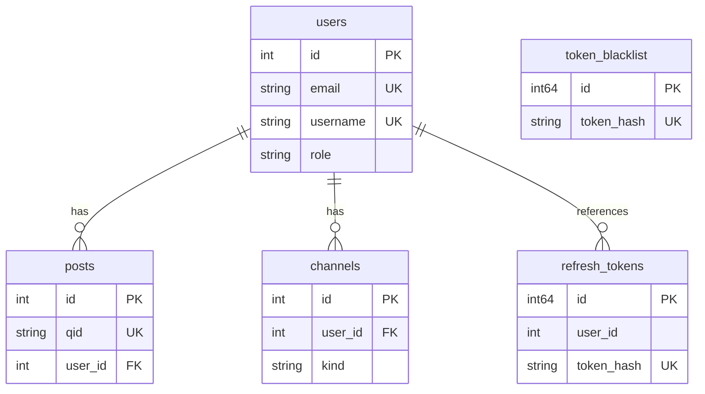

# Database Schema

This document describes the current database schema for MarkPost. The schema is defined through GORM model structs in `internal/domain/` and managed via GORM `AutoMigrate`. The project supports both PostgreSQL (production) and SQLite (development/testing) — type descriptions below use GORM semantics and are not tied to a specific database engine.

## Entity Relationship Diagram

> **Note:** `refresh_tokens.user_id` references `users.id` logically but has no database-level foreign key constraint.

## Tables

### `users`

Defined in `internal/domain/user/user.go`. Stores user accounts with support for both password-based and GitHub OAuth authentication.

| Go Field | DB Column | Type | Nullable | Default | Constraints | Description |
|----------|-----------|------|----------|---------|-------------|-------------|
| `ID` | `id` | integer auto-increment | no | — | PK | Primary key |
| `Email` | `email` | varchar | no | — | unique | User email address |
| `Username` | `username` | varchar | no | — | unique | Unique username for login |
| `Name` | `name` | varchar | yes | — | — | Display name |
| `Password` | `password_hash` | varchar | yes | — | — | Bcrypt-hashed password; empty for OAuth-only users |
| `AvatarURL` | `avatar_url` | varchar | yes | — | — | Profile avatar URL, typically from GitHub |
| `PostKey` | `post_key` | varchar | no | — | unique | API key for creating posts via external tools |
| `GitHubID` | `github_id` | bigint | yes | — | unique | GitHub user ID for OAuth binding |
| `Role` | `role` | varchar | no | `'user'` | — | User role. Values: `'admin'`, `'user'` |
| `IsActive` | `is_active` | boolean | no | `true` | — | Whether the account is active |
| `IsEmailVerified` | `is_email_verified` | boolean | no | `false` | — | Whether the email has been verified |
| `LastLoginAt` | `last_login_at` | timestamp | yes | — | — | Timestamp of last successful login |
| `CreatedAt` | `created_at` | timestamp | no | `now()` | — | Record creation time (auto) |
| `UpdatedAt` | `updated_at` | timestamp | no | `now()` | — | Record last update time (auto) |

### `posts`

Defined in `internal/domain/post/post.go`. Stores user posts with Markdown body content.

| Go Field | DB Column | Type | Nullable | Default | Constraints | Description |
|----------|-----------|------|----------|---------|-------------|-------------|
| `ID` | `id` | integer auto-increment | no | — | PK | Primary key |
| `QID` | `qid` | varchar | no | — | unique | Unique public identifier with `p-` prefix for external references |
| `Title` | `title` | varchar | no | — | — | Post title |
| `Body` | `body` | text | no | — | — | Post body in Markdown |
| `UserID` | `user_id` | integer | no | — | FK → `users`, ON DELETE CASCADE, index | Author of the post |
| `CreatedAt` | `created_at` | timestamp | no | `now()` | — | Record creation time (auto) |
| `UpdatedAt` | `updated_at` | timestamp | no | `now()` | — | Record last update time (auto) |

### `refresh_tokens`

Defined in `internal/domain/user/token.go`. Stores hashed refresh tokens for JWT authentication. Write-once — records are created and deleted, never updated.

Explicit table name: `refresh_tokens`.

| Go Field | DB Column | Type | Nullable | Default | Constraints | Description |
|----------|-----------|------|----------|---------|-------------|-------------|
| `ID` | `id` | bigint auto-increment | no | — | PK | Primary key |
| `UserID` | `user_id` | integer | no | — | index | Owning user (no FK constraint; cleanup handled at application level) |
| `TokenHash` | `token_hash` | varchar | no | — | unique | SHA256 hash of the refresh token |
| `ExpiresAt` | `expires_at` | timestamp | no | — | — | Token expiration time |
| `CreatedAt` | `created_at` | timestamp | no | `now()` | — | Record creation time (auto) |

### `token_blacklist`

Defined in `internal/domain/user/token.go`. Stores blacklisted JWT token hashes for logout and revocation. Write-once — records are created and expired, never updated.

Explicit table name: `token_blacklist`.

| Go Field | DB Column | Type | Nullable | Default | Constraints | Description |
|----------|-----------|------|----------|---------|-------------|-------------|
| `ID` | `id` | bigint auto-increment | no | — | PK | Primary key |
| `TokenHash` | `token_hash` | varchar | no | — | unique, index | Hash of the blacklisted JWT |
| `ExpiresAt` | `expires_at` | timestamp | no | — | index | Token expiration; used for periodic cleanup of stale entries |
| `CreatedAt` | `created_at` | timestamp | no | `now()` | — | Record creation time (auto) |

### `channels`

Defined in `internal/domain/delivery/delivery.go`. Stores delivery channel configurations for pushing post notifications to external services.

| Go Field | DB Column | Type | Nullable | Default | Constraints | Description |
|----------|-----------|------|----------|---------|-------------|-------------|
| `ID` | `id` | integer auto-increment | no | — | PK | Primary key |
| `UserID` | `user_id` | integer | no | — | FK → `users`, ON DELETE CASCADE, index | Owning user |
| `Kind` | `kind` | varchar(32) | no | — | — | Channel type. Values: `'feishu'` |
| `Name` | `name` | varchar | no | `''` | — | Human-readable channel name |
| `Enabled` | `enabled` | boolean | no | `true` | — | Whether the channel is active |
| `WebhookURL` | `webhook_url` | text | no | — | — | Webhook endpoint URL for push notifications |
| `Keywords` | `keywords` | text | no | `''` | — | Comma-separated keywords for filtering posts to push |
| `CreatedAt` | `created_at` | timestamp | no | `now()` | — | Record creation time (auto) |
| `UpdatedAt` | `updated_at` | timestamp | no | `now()` | — | Record last update time (auto) |

## Design Conventions

### 1. Primary Keys

All tables use auto-increment integer primary keys. Business tables (`users`, `posts`, `channels`) use `int`. Token and security tables (`refresh_tokens`, `token_blacklist`) use `int64` to accommodate higher write volume.

### 2. Timestamps

Business tables include both `created_at` and `updated_at` with GORM auto-population (`autoCreateTime` / `autoUpdateTime`). Write-once tables (`refresh_tokens`, `token_blacklist`) only have `created_at` — their records are never modified after creation.

### 3. No Soft Delete

No tables use soft delete. Records are permanently removed via `DELETE` statements.

### 4. Foreign Keys and Cascading Deletes

GORM association fields (e.g., `Post.User`, `Channel.User`) define `ON DELETE CASCADE` to enforce referential integrity at the database level. Bare ID references without a GORM association (e.g., `RefreshToken.UserID`) have no foreign key constraint — cleanup is handled at the application level.

### 5. Dual Database Support

Production uses PostgreSQL; development and testing use SQLite (in-memory for tests). Schema is defined exclusively through GORM struct tags to remain compatible across both engines. Avoid database-specific column types or features in model definitions.

### 6. Schema Migration

Schema changes are applied via GORM `AutoMigrate` on application startup (see `internal/infra/db.go`). There is no versioned migration system. Ad-hoc data migrations (e.g., `migrateQIDPrefix`) run as startup functions alongside AutoMigrate.

### 7. Table Naming

Tables without an explicit `TableName()` method use GORM's default pluralized naming (e.g., `users`, `posts`, `channels`). Tables that define `TableName()` specify their name explicitly in the model struct (e.g., `refresh_tokens`, `token_blacklist`).
