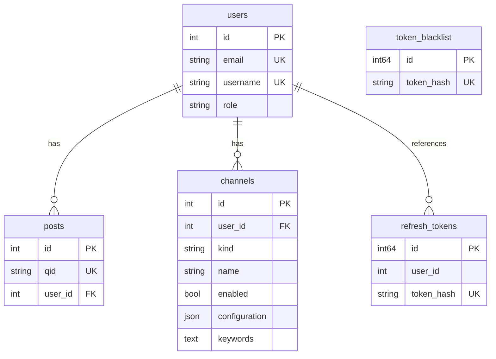

# 数据库 Schema

[English](database-schema.md) | 中文

本文档描述 markpost 的当前数据库 schema。schema 由 `internal/domain/` 中的 GORM model struct 定义，并通过 `golang-migrate` 的版本化 SQL 迁移管理（内嵌于二进制的 `internal/infra/migrations/`）。PostgreSQL 17 是唯一支持的数据库。下文的类型描述采用 PostgreSQL 语义。

## 实体关系图

> **注**：`refresh_tokens.user_id` 逻辑上引用 `users.id`，但没有数据库级外键约束。

## 数据表

### `users`

定义于 `internal/domain/user/user.go`。存储用户账户，同时支持密码认证与 GitHub OAuth 认证。

| Go 字段           | 数据库列            | 类型                   | 可空 | 默认值   | 约束   | 说明                                 |
| ----------------- | ------------------- | ---------------------- | ---- | -------- | ------ | ------------------------------------ |
| `ID`              | `id`                | integer auto-increment | 否   | —        | PK     | 主键                                 |
| `Email`           | `email`             | varchar                | 否   | —        | unique | 用户邮箱地址                         |
| `Username`        | `username`          | varchar                | 否   | —        | unique | 登录用的唯一用户名                   |
| `Name`            | `name`              | varchar                | 是   | —        | —      | 显示名                               |
| `Password`        | `password_hash`     | varchar                | 是   | —        | —      | Bcrypt 哈希密码；OAuth-only 用户为空 |
| `AvatarURL`       | `avatar_url`        | varchar                | 是   | —        | —      | 个人头像 URL，通常来自 GitHub        |
| `PostKey`         | `post_key`          | varchar                | 否   | —        | unique | 供外部工具创建文章的 API key         |
| `GitHubID`        | `github_id`         | bigint                 | 是   | —        | unique | OAuth 绑定用的 GitHub 用户 ID        |
| `Role`            | `role`              | varchar                | 否   | `'user'` | —      | 用户角色。取值：`'admin'`、`'user'`  |
| `IsActive`        | `is_active`         | boolean                | 否   | `true`   | —      | 账户是否启用                         |
| `IsEmailVerified` | `is_email_verified` | boolean                | 否   | `false`  | —      | 邮箱是否已验证                       |
| `LastLoginAt`     | `last_login_at`     | timestamp              | 是   | —        | —      | 最近一次成功登录的时间戳             |
| `CreatedAt`       | `created_at`        | timestamp              | 否   | `now()`  | —      | 记录创建时间（自动）                 |
| `UpdatedAt`       | `updated_at`        | timestamp              | 否   | `now()`  | —      | 记录最后更新时间（自动）             |

### `posts`

定义于 `internal/domain/post/post.go`。存储用户文章，正文为 Markdown 内容。

| Go 字段     | 数据库列     | 类型                   | 可空 | 默认值  | 约束                                   | 说明                             |
| ----------- | ------------ | ---------------------- | ---- | ------- | -------------------------------------- | -------------------------------- |
| `ID`        | `id`         | integer auto-increment | 否   | —       | PK                                     | 主键                             |
| `QID`       | `qid`        | varchar                | 否   | —       | unique                                 | 带前缀的唯一公开标识，供外部引用 |
| `Title`     | `title`      | varchar                | 否   | —       | —                                      | 文章标题                         |
| `Body`      | `body`       | text                   | 否   | —       | —                                      | Markdown 正文                    |
| `UserID`    | `user_id`    | integer                | 否   | —       | FK → `users`，ON DELETE CASCADE，index | 文章作者                         |
| `CreatedAt` | `created_at` | timestamp              | 否   | `now()` | —                                      | 记录创建时间（自动）             |
| `UpdatedAt` | `updated_at` | timestamp              | 否   | `now()` | —                                      | 记录最后更新时间（自动）         |

### `refresh_tokens`

定义于 `internal/domain/user/token.go`。存储 JWT 认证用的刷新令牌哈希。记录创建后**软吊销**（`revoked=true`）；行保留用于刷新令牌盗窃重用检测（见 [auth.md](../auth.zh.md) §2.2-2.3）。已过期且已吊销的行由定期清理物理删除。

显式表名：`refresh_tokens`。

| Go 字段     | 数据库列     | 类型                  | 可空 | 默认值  | 约束   | 说明                                                                                    |
| ----------- | ------------ | --------------------- | ---- | ------- | ------ | --------------------------------------------------------------------------------------- |
| `ID`        | `id`         | bigint auto-increment | 否   | —       | PK     | 主键                                                                                    |
| `UserID`    | `user_id`    | integer               | 否   | —       | index  | 归属用户（无 FK 约束；清理由应用层处理）                                                |
| `TokenHash` | `token_hash` | varchar               | 否   | —       | unique | 刷新令牌的 SHA256 哈希                                                                  |
| `Revoked`   | `revoked`    | boolean               | 否   | `false` | —      | 吊销标记。`true` 表示已吊销（用于刷新令牌盗窃重用检测，见 [auth.md](../auth.zh.md) §2） |
| `ExpiresAt` | `expires_at` | timestamp             | 否   | —       | —      | 令牌过期时间                                                                            |
| `CreatedAt` | `created_at` | timestamp             | 否   | `now()` | —      | 记录创建时间（自动）                                                                    |

### `token_blacklist`

定义于 `internal/domain/user/token.go`。存储登出与吊销用的 JWT 哈希黑名单。只写——记录只创建与过期，永不更新。

显式表名：`token_blacklist`。

| Go 字段     | 数据库列     | 类型                  | 可空 | 默认值  | 约束         | 说明                                 |
| ----------- | ------------ | --------------------- | ---- | ------- | ------------ | ------------------------------------ |
| `ID`        | `id`         | bigint auto-increment | 否   | —       | PK           | 主键                                 |
| `TokenHash` | `token_hash` | varchar               | 否   | —       | unique,index | 被拉黑 JWT 的哈希                    |
| `ExpiresAt` | `expires_at` | timestamp             | 否   | —       | index        | 令牌过期时间；用于过期条目的定期清理 |
| `CreatedAt` | `created_at` | timestamp             | 否   | `now()` | —            | 记录创建时间（自动）                 |

### `channels`

定义于 `internal/domain/delivery/delivery.go`。存储投递渠道配置，用于把文章通知推送到外部服务。

| Go 字段         | 数据库列        | 类型                   | 可空 | 默认值  | 约束                                   | 说明                                                                                          |
| --------------- | --------------- | ---------------------- | ---- | ------- | -------------------------------------- | --------------------------------------------------------------------------------------------- |
| `ID`            | `id`            | integer auto-increment | 否   | —       | PK                                     | 主键                                                                                          |
| `UserID`        | `user_id`       | integer                | 否   | —       | FK → `users`，ON DELETE CASCADE，index | 归属用户                                                                                      |
| `Kind`          | `kind`          | varchar(32)            | 否   | —       | —                                      | 渠道类型。取值：`'feishu'`                                                                    |
| `Name`          | `name`          | varchar                | 否   | `''`    | —                                      | 人类可读的渠道名                                                                              |
| `Enabled`       | `enabled`       | boolean                | 否   | `true`  | —                                      | 渠道是否启用                                                                                  |
| `Configuration` | `configuration` | text                   | 否   | `'{}'`  | —                                      | JSON 编码的渠道配置（如飞书 `webhook_url`、`card_link_url`）                                  |
| `Keywords`      | `keywords`      | text                   | 否   | `''`    | —                                      | 决定是否推送文章的过滤表达式（写入时校验；见 [keyword-filter.zh.md](./keyword-filter.zh.md)） |
| `CreatedAt`     | `created_at`    | timestamp              | 否   | `now()` | —                                      | 记录创建时间（自动）                                                                          |
| `UpdatedAt`     | `updated_at`    | timestamp              | 否   | `now()` | —                                      | 记录最后更新时间（自动）                                                                      |

## 设计约定

### 1. 主键

所有表使用自增整数主键。业务表（`users`、`posts`、`channels`）用 `int`。令牌与安全表（`refresh_tokens`、`token_blacklist`）用 `int64`，以承载更高的写入量。

### 2. 时间戳

业务表同时含 `created_at` 与 `updated_at`，由 GORM 自动填充（`autoCreateTime` / `autoUpdateTime`）。只写表（`refresh_tokens`、`token_blacklist`）只有 `created_at`——其记录创建后永不修改。

### 3. 无软删除

所有表均不用软删除。记录通过 `DELETE` 语句永久移除。

### 4. 外键与级联删除

GORM 关联字段（如 `Post.User`、`Channel.User`）定义 `ON DELETE CASCADE`，在数据库层强制引用完整性。无 GORM 关联的裸 ID 引用（如 `RefreshToken.UserID`）不带外键约束——清理由应用层处理。

### 5. 仅 PostgreSQL

PostgreSQL 17 是唯一支持的数据库。schema 完全通过版本化 SQL 迁移（`internal/infra/migrations/`）管理。GORM struct tag 记录 model 的列元数据，但不驱动 schema 变更。

### 6. Schema 迁移

schema 变更通过 `golang-migrate` 与 `internal/infra/migrations/` 中的版本化 SQL 文件（内嵌于二进制）应用。部署时在 `serve` 前运行 `markpost migrate up`。`infra.New(dsn)` 只打开连接，不迁移。

### 7. 表命名

没有显式 `TableName()` 方法的表使用 GORM 默认复数命名（如 `users`、`posts`、`channels`）。定义了 `TableName()` 的表在 model struct 中显式指定表名（如 `refresh_tokens`、`token_blacklist`）。

---

## 数据库连接（DSN）

Schema 设计只管表结构。数据库连接（DSN 格式）见 [dsn.zh.md](./dsn.zh.md)。
