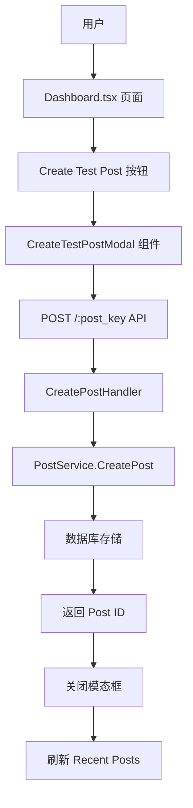

# Design Document
# 创建测试 Post 功能设计

## Overview

本设计文档描述了在 Markpost 系统的 Dashboard 页面添加"创建测试 Post"功能的详细实现方案。该功能允许用户通过模态框界面快速创建临时的 Markdown 内容 Post，无需跳转页面，提升用户体验和工作效率。

### 关键设计决策

1. **在 Post Key 板块添加按钮**：利用现有 Dashboard 布局，在 Post Key 卡片的底部添加"Create Test Post"按钮
2. **模态框组件设计**：使用 React Bootstrap 的 Modal 组件，确保 UI 一致性
3. **表单验证策略**：依赖后端验证，前端不做长度校验
4. **Recent Posts 刷新**：创建成功后刷新 Recent Posts 列表
5. **简化测试**：仅进行端对端测试

## Architecture

### 系统架构图



### 前端架构

```
frontend/src/
├── components/
│   └── CreateTestPostModal.tsx  [新增] 创建测试 Post 模态框组件
├── utils/
│   ├── api.ts                  [扩展] 添加 createTestPost 函数
└── pages/
    └── Dashboard.tsx            [修改] 集成模态框和按钮
```

### 后端架构（无需修改）

现有的后端 API `/api/:post_key` 已满足需求：
- 路径：`POST /:post_key`
- 请求体：`{ title: string, body: string }`
- 响应：`{ id: string }`
- 中间件：RateLimit + PostKeyMiddleware + CreatePostHandler

## Components and Interfaces

### 1. CreateTestPostModal 组件接口

```typescript
interface CreateTestPostModalProps {
  show: boolean;
  postKey: string;
  onHide: () => void;
  onSuccess: () => void;
}

interface CreateTestPostFormData {
  title: string;
  body: string;
}
```

### 2. API 工具函数接口

```typescript
// utils/api.ts
export async function createTestPost(
  postKey: string,
  title: string,
  body: string
): Promise<string>;
```

### 3. Dashboard.tsx 集成接口

```typescript
// 在 Dashboard 组件中添加：
const [showCreateModal, boolean];
const loadRecentPosts: () => Promise<void>;

// Post Key 板块新增按钮：
<CreateTestPostModal
  show={showCreateModal}
  postKey={postKey}
  onHide={() => setShowCreateModal(false)}
  onSuccess={() => {
    setShowCreateModal(false);
    loadRecentPosts();
  }}
/>
```

### 4. 表单字段规范

| 字段 | 类型 | 必填 | 描述 |
|------|------|------|------|
| title | text | 否 | Post 标题，可选 |
| body | textarea | 是 | Markdown 内容，必填 |

## Data Models

### 前端类型定义

```typescript
interface CreateTestPostRequest {
  title: string;
  body: string;
}

interface CreateTestPostResponse {
  id: string;
}
```

### 后端数据结构（复用现有）

```go
// handlers.go:63
type PostRequest struct {
    Title string `json:"title" binding:"required"`
    Body  string `json:"body" binding:"required"`
}
```

## Error Handling

### 错误处理策略

| HTTP 状态码 | 错误原因 | 用户提示 | 处理方式 |
|-------------|----------|----------|----------|
| 400 | 验证失败 | 显示后端返回的错误信息 | 保持模态框打开 |
| 401 | 未授权 | 跳转到登录页 | 重定向到 /ui/login |
| 403 | 禁止访问 | "禁止访问" | 保持模态框打开 |
| 404 | Post Key 无效 | "Post Key 无效" | 关闭模态框 |
| 429 | 频率限制 | "操作过于频繁，请稍后重试" | 保持模态框打开 |
| 500 | 服务器错误 | "服务器错误，请稍后重试" | 保持模态框打开 |
| 超时 | 网络超时 | "请求超时，请检查网络连接" | 保持模态框打开 |

## Testing Strategy

### 端对端测试

端到端测试覆盖完整用户流程：

```typescript
// tests/dashboard-create-post.e2e.spec.ts
describe("创建测试 Post 功能", () => {
  it("完整创建流程：点击按钮 → 填写表单 → 提交 → 查看 Recent Posts", () => {
    // 1. 访问 Dashboard 页面
    // 2. 点击 Post Key 板块的 "Create Test Post" 按钮
    // 3. 填写表单（标题和内容）
    // 4. 点击提交按钮
    // 5. 验证模态框关闭
    // 6. 验证 Recent Posts 列表刷新
    // 7. 验证新创建的 Post 出现在列表中
  });

  it("验证失败场景：提交空内容", () => {
    // 1. 打开模态框
    // 2. 不填写任何内容直接提交
    // 3. 验证后端返回 400 错误
    // 4. 验证错误信息显示
    // 5. 验证模态框保持打开
  });

  it("验证失败场景：标题或内容过长", () => {
    // 1. 打开模态框
    // 2. 填写超长标题或超长内容（超过后端限制）
    // 3. 提交表单
    // 4. 验证后端返回 400 错误
    // 5. 验证错误信息显示（如"标题过长"或"内容过长"）
    // 6. 验证模态框保持打开
  });

  it("验证错误处理：服务器错误", () => {
    // 1. 打开模态框
    // 2. 填写有效内容
    // 3. 模拟服务器 500 错误
    // 4. 验证错误信息显示
    // 5. 验证模态框保持打开
  });

  it("验证模态框关闭功能", () => {
    // 1. 打开模态框
    // 2. 测试关闭方式：
    //    - 点击 X 按钮
    //    - 点击背景遮罩
    //    - 按 ESC 键
    //    - 点击取消按钮
    // 3. 验证模态框正确关闭
    // 4. 验证表单数据清空
  });
});
```

### 测试覆盖范围

- ✅ 完整用户流程（创建 Post 到查看 Recent Posts）
- ✅ 表单验证（后端验证）
  - 提交空内容场景
  - 提交过长标题或内容场景
- ✅ 错误处理（各种错误场景）
- ✅ 模态框交互（所有关闭方式）

## 用户界面设计

### 1. 按钮设计

位置：Post Key 卡片底部，与创建时间信息对齐
样式：`variant="primary"`, `size="sm"`

### 2. 模态框设计

- **尺寸**：中等大小（Modal.Size.LG）
- **标题**："创建测试 Post"
- **关闭选项**：
  - 右上角 X 按钮
  - 背景点击
  - ESC 键
  - 取消按钮

### 3. 表单布局

```
Modal Header
├── Title: "创建测试 Post"
└── Close button (X)

Modal Body
├── Title Input Field
│   ├── Label: "标题（可选）"
│   └── Placeholder: "输入 Post 标题..."
│
├── Body Textarea
│   ├── Label: "内容 *"
│   └── Placeholder: "输入 Markdown 内容..."
│
└── Error Alert (if any)

Modal Footer
├── Cancel Button (secondary)
└── Create Post Button (primary, loading when submitting)
```
