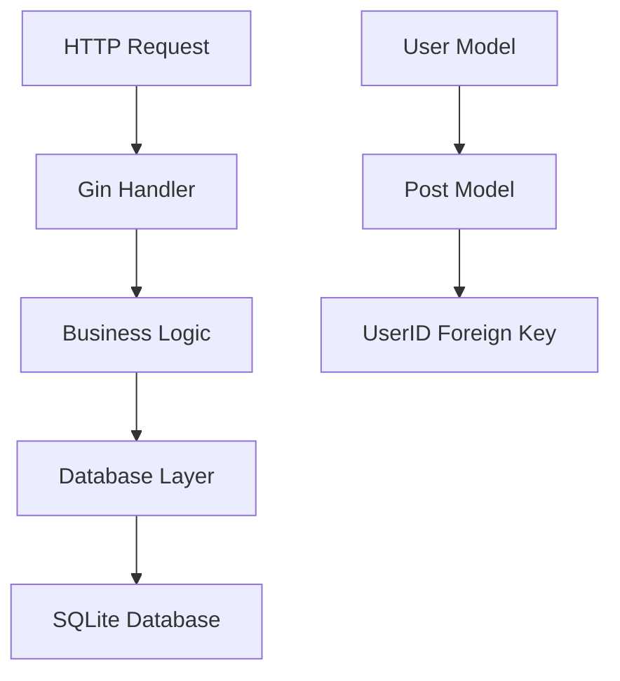

# 设计文档

## 概述

本设计文档描述了用户-post 关联功能的实现方案。该功能将在现有的 markpost 系统中添加用户与 post 之间的关联关系，使系统能够追踪每个 post 的创建者。

### 设计目标

- 在 Post 模型中添加 UserID 外键字段，建立与 User 模型的一对多关系
- 修改 post 创建逻辑，自动关联当前登录用户
- 保持向后兼容性，允许匿名 post（UserID 为空）
- 确保数据完整性和查询性能

## 架构

### 当前架构分析

当前系统采用简单的三层架构：

- **表示层**: Gin Web 框架处理 HTTP 请求
- **业务逻辑层**: handlers.go 中的处理函数
- **数据访问层**: db.go 中的数据库操作函数

### 架构变更

本次设计不改变整体架构，仅在数据模型层面添加关联关系：



## 组件和接口

### 数据模型组件

#### User 模型（现有）

```go
type User struct {
    ID       int    `json:"id" gorm:"primaryKey;autoIncrement"`
    Username string `json:"username" gorm:"unique;not null"`
    PostKey  string `json:"post_key" gorm:"not null"`
    GitHubID *int64 `json:"github_id" gorm:"column:github_id;uniqueIndex"`
}
```

#### Post 模型（更新后）

```go
type Post struct {
    ID        string    `json:"id" gorm:"primaryKey"`
    Title     string    `json:"title" gorm:"not null"`
    Body      string    `json:"body" gorm:"not null"`
    CreatedAt time.Time `json:"created_at" gorm:"autoCreateTime"`
    UserID    *int      `json:"user_id" gorm:"index;foreignKey:ID;references:users"`
}
```

### 数据库操作接口

#### 新增接口

```go
// CreatePostWithUser 创建关联用户的post
func CreatePostWithUser(title, body string, userID int) (*Post, error)

// GetPostsByUserID 获取指定用户创建的所有post
func GetPostsByUserID(userID int) ([]Post, error)

// GetPostWithUser 获取post及其创建者信息
func GetPostWithUser(id string) (*PostWithUser, error)
```

#### 更新接口

```go
// CreatePost 更新现有接口，添加可选的userID参数
func CreatePost(title, body string, userID ...int) (*Post, error)
```

### 业务逻辑组件

#### Post 创建逻辑更新

- 在`CreatePostHandler`中通过`c.Get("user")`获取当前用户信息
- 调用更新后的`CreatePost`函数，传入用户 ID
- 保持向后兼容性，支持匿名 post 创建

#### 用户认证中间件

- 利用现有的 AuthMiddleware 中间件
- 通过 post_key 参数验证用户身份
- 用户信息已通过 `c.Set("user", user)` 注入到请求上下文中

## 数据模型

### 数据库表结构

#### users 表（现有）

```sql
CREATE TABLE users (
    id INTEGER PRIMARY KEY AUTOINCREMENT,
    username TEXT UNIQUE NOT NULL,
    post_key TEXT NOT NULL,
    github_id INTEGER UNIQUE
);
```

#### posts 表（更新后）

```sql
CREATE TABLE posts (
    id TEXT PRIMARY KEY,
    title TEXT NOT NULL,
    body TEXT NOT NULL,
    created_at DATETIME NOT NULL,
    user_id INTEGER,
    FOREIGN KEY (user_id) REFERENCES users(id)
);
CREATE INDEX idx_posts_user_id ON posts(user_id);
```

### 关系设计

- **一对多关系**: 一个用户可以创建多个 post
- **外键约束**: Post.UserID 引用 User.ID
- **可空设计**: UserID 允许为 NULL，支持匿名 post
- **索引优化**: 在 UserID 字段上创建索引，提高查询性能

### 数据迁移策略

1. **向后兼容**: 现有 post 的 UserID 字段将设置为 NULL
2. **渐进式迁移**: 新创建的 post 将自动关联用户

## 错误处理

### 数据库错误处理

```go
// 外键约束违反
if err != nil && strings.Contains(err.Error(), "FOREIGN KEY constraint failed") {
    return nil, fmt.Errorf("invalid user ID: %w", err)
}

// 用户不存在
if err == gorm.ErrRecordNotFound {
    return nil, fmt.Errorf("user not found: %w", err)
}
```

### 业务逻辑错误处理

- 无效的 post_key：返回 403 禁止访问错误
- 无效的用户 ID：返回 400 错误请求
- 数据库操作失败：返回 500 内部服务器错误

### 错误响应格式

```json
{
  "error": "错误描述",
  "code": "ERROR_CODE",
  "details": "详细错误信息"
}
```

## 实现计划

### 阶段 1: 数据模型更新

1. 更新 Post 模型，添加 UserID 字段
2. 创建数据库迁移脚本
3. 更新 AutoMigrate 逻辑

### 阶段 2: 数据库操作函数

1. 实现 CreatePostWithUser 函数
2. 实现 GetPostsByUserID 函数
3. 更新现有 CreatePost 函数

### 阶段 3: 业务逻辑集成

1. 更新 CreatePostHandler，从请求上下文获取用户信息
2. 利用现有的 AuthMiddleware 进行用户认证
3. 添加错误处理

## 风险评估

### 技术风险

- **数据迁移风险**: 现有数据可能受到影响
- **性能风险**: 外键约束可能影响查询性能
- **兼容性风险**: 现有 API 可能受到影响

### 缓解措施

- **渐进式迁移**: 分阶段实施，降低风险
- **性能测试**: 在实施前进行性能基准测试
- **向后兼容**: 保持现有 API 的兼容性
- **回滚计划**: 准备数据回滚方案
